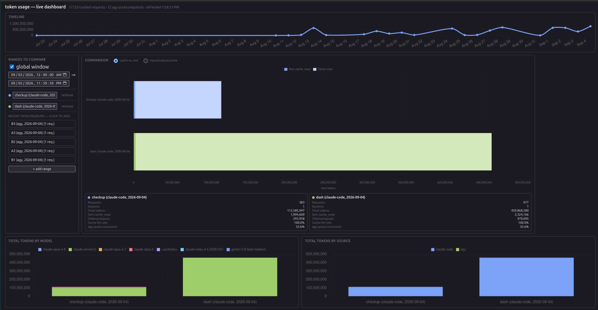

# ai-tokens-tracker

Rastreia o consumo de tokens/quota de agentes de IA — leve, sem custo de token para coletar.

Cobre hoje o Google Antigravity CLI (`agy`, incluindo uso via TUI, não só chamadas `-p`) e o
Claude Code (via transcripts locais). Outros agentes (hermes, opencode) estão planejados — ver
"Limitações conhecidas" e a arquitetura hexagonal abaixo, pensada para receber um novo adapter por
agente sem reescrever o resto do pipeline. `core/model.UsageEvent` normaliza qualquer fonte com
tokens por request numa forma comum, então views/relatórios não precisam saber qual ferramenta
gerou o dado.

Ver `docs/madrs/` para o racional completo (por que `/usage` polling e não outras fontes
consideradas — protobuf interno, LiteLLM, screen-scraping — todas rejeitadas).



## Como funciona

- `scripts/agy-snapshot.py` — roda `agy -p "/usage" --output-format json` (custo **zero** de
  token, é um comando meta) e grava a quota semanal restante por grupo de modelo no SQLite.
  Pensado para rodar em cron/timer, ex. de hora em hora.
- `scripts/agy-track.py` — wrapper opcional de `agy -p` para tarefas específicas: registra
  tokens exatos daquela chamada, com um label.
- `scripts/claude-code-snapshot.py` — lê `~/.claude/projects/**/*.jsonl` recursivamente (transcripts
  locais já escritos pelo Claude Code, custo **zero** de token) e grava tokens exatos por request
  no SQLite. Incremental via cursor de byte offset — seguro rodar com frequência (ex. a cada
  5min). Inclui subagentes (`subagents/**/*.jsonl`, inclusive os do Workflow tool) — esses eventos
  compartilham o `session_id` da conversa que os lançou (não têm sessão própria), mas carregam um
  `agent_id` distinto (`isSidechain: true` no transcript), então dá pra separá-los por agente
  mesmo agrupados na mesma sessão. Essa cobertura foi adicionada em 2026-09-04 — históricos
  coletados antes dessa data estavam subcontados (não incluíam subagentes).
- `scripts/agy-report.py` — gera um HTML standalone (Chart.js via CDN, sem servidor) com os
  dados coletados.
- `scripts/token-compare-report.py` — gera um HTML standalone (snapshot único, sem servidor)
  para comparar consumo de tokens entre janelas de tempo à mão livre, com precisão de segundo
  (ex: sessão de manhã com `/goriok-skills:recall-search` vs. sessão à tarde sem, no mesmo dia),
  sem precisar marcar nada previamente — a seleção dos períodos acontece na própria página em
  UTC. Unifica qualquer fonte com tokens por request (`core/usage.collect_usage_events`), hoje
  Claude Code e chamadas rastreadas do agy. Para ver dados novos é preciso rodar de novo — não
  atualiza sozinho.
- `scripts/token_dashboard_server.py` — mesma comparação, mas como servidor local (FastAPI) que
  relê o SQLite a cada request: a página se atualiza sozinha a cada 15s via `/api/usage`, sem
  precisar regenerar arquivo. Única peça do projeto com dependências externas (fastapi/uvicorn) —
  roda via `uv run`, não `python3` puro.
- `scripts/agy-widget-gtk.py` — widget GTK3 always-on-top (Linux desktop), mostra quota atual
  e chamadas rastreadas do dia.
- `scripts/agy-delegate.py` — roda uma tarefa via `agy -p`, escolhendo o modelo automaticamente
  por complexidade (`--complexity low|medium|high`) + quota semanal restante (ver
  `core/model_policy.py`), registrando o resultado como uma chamada rastreada.

Dados em `~/.local/share/ai-tokens-tracker/usage.db` (SQLite; sobrescrevível via `$AGY_TOOL_DB`).

## Testes

```bash
uv run --group dev pytest
```

## Arquitetura

Hexagonal (ports & adapters — racional original em `docs/madrs/MADR-002`, hoje com um port a mais):

```
core/interfaces.py                    # portas: UsageStore, AgyRunner, ClaudeCodeTranscriptReader
core/usage.py                         # collect_usage_events — normaliza qualquer fonte pra UsageEvent
adapters/sqlite_usage_store.py        # único adapter de UsageStore hoje
adapters/agy_cli_runner.py            # único adapter de AgyRunner hoje
adapters/claude_code_transcript_reader.py   # único adapter de ClaudeCodeTranscriptReader hoje
scripts/                              # aplicação — usa só as portas, nunca sqlite3/subprocess direto
```

Um agente novo (hermes, opencode) vira um adapter novo (porta existente ou nova, conforme o tipo
de dado que ele expõe) — sem reescrever `scripts/` nem `core/usage.py`.

## Instalação

### Standalone

```bash
bash install.sh   # symlinks bin/agystatus, bin/agysnapshot, bin/agywidget, bin/agydelegate,
                   # bin/claudecodesnapshot, bin/tokencompare, bin/tokendashboard em ~/.local/bin/
uv sync            # instala as dependências (necessário só para tokendashboard)
```

### Como plugin do Claude Code

```
/plugin marketplace add goriok/ai-tokens-tracker
/plugin install ai-tokens-tracker
```

Registra a skill `agy-tracking` e os comandos `/agy-status`, `/agy-widget`.

**Atualizar:** `/plugin marketplace update goriok/ai-tokens-tracker`, seguido de `/reload-plugins`
para o Claude Code recarregar o conteúdo novo — sem o reload, o autocomplete de slash command
continua mostrando a versão em cache.

### Como plugin do Antigravity (`agy`)

```bash
agy plugin install /path/to/ai-tokens-tracker/plugins/ai-tokens-tracker
# ou, a partir de um clone:
git clone git@github.com:goriok/ai-tokens-tracker.git
agy plugin install ./ai-tokens-tracker/plugins/ai-tokens-tracker
```

`plugins/ai-tokens-tracker/skills/` é um symlink para `../../skills` (a mesma pasta que o Claude
Code usa) — uma única fonte, sem duplicar conteúdo entre os dois formatos.

**Atualizar:** `git pull` no clone, depois `agy plugin install ./ai-tokens-tracker/plugins/ai-tokens-tracker`
de novo — sobrescreve o registro anterior em `~/.gemini/config/plugins/ai-tokens-tracker/`. Não
existe `agy plugin update`; instalar de novo é o mecanismo de atualização. `agy plugin validate
./ai-tokens-tracker/plugins/ai-tokens-tracker` confirma que a pasta está bem formada antes de
instalar.

## Uso

```bash
agysnapshot     # registra um snapshot de quota agora (custo zero)
claudecodesnapshot  # registra novos eventos do Claude Code agora (custo zero)
agystatus       # gera e abre o relatório HTML
tokencompare    # gera e abre o comparativo de janelas de tempo (snapshot único)
tokendashboard  # sobe o comparativo como servidor local, se atualiza sozinho
agywidget       # widget GTK always-on-top (Linux)
agydelegate --complexity low --task "revisão de PR" "revise este diff..."

python3 scripts/agy-track.py --model gemini-3.7-flash-low --task "revisão de PR" "revise este diff..."
```

Para coleta automática (sem precisar rodar os comandos à mão), instalar os units systemd —
ver `systemd/README.md`.

## Limitações conhecidas

- Cobre `agy` e Claude Code hoje — alguns nomes de comando (`agystatus`, `agysnapshot`,
  `agywidget`, `agydelegate`) ainda carregam o prefixo `agy` por serem os mais antigos, mas o
  schema de dados (`UsageEvent`) já é agnóstico de ferramenta. Suporte a hermes/opencode é
  planejado, sem data definida.
- `/usage` dá consumo agregado por grupo de modelo e janela semanal, não por tarefa individual.
  "Quantos tokens uma tarefa específica gastou" só é respondível para chamadas feitas via
  `agy-track.py`, não para uso via TUI.
- Se o `agy` mudar o schema de saída de `/usage`, a coleta falha alto (não grava dado
  inconsistente silenciosamente) — ver `AgyCliRunner.fetch_usage`.
